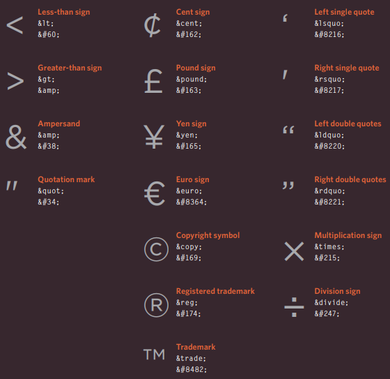
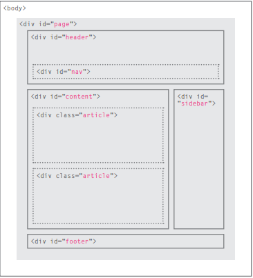

# HTML

HTML helps to describe the structure of a web page. It helps the computer understand how to order what's being presented on the screen for your users to see. HTML uses things called *elements* to help in the description. 

The outter layer of the structure is the *`<html>`* tag, which denotes the type of document that is being created. Within the HTML tag is the *`<body>`*tag, this is where you would write in majority of the info you'd like to come accross the screen. In order to better structure the *body* you would use a header tag *`<h1>`*. Header tags range frome 1-6, these numbers tell the text how large or small to be. You can only have one *`<h1>`* in any given document. *`<h2>`* tags can be used as often as you'd like, these are usually used as sub-headers. Within your headers is where you would use *`
`* to write out your paragraphs. The *`<head>`* is where you store info ***about*** the page, using a *`<title>`* element will give the name that's shown on the tabs of the windows open on the internet. Every element has an opening (`<#>`) and closing (`</#>`) tag that the information lies inbetween. `<meta>` lives inside the head and contains info about the web page. It's not visibile but helps by telling search engines about your page, who created it and if it's time sensitive or not.

Here is a basic outline of an HTML document.

-`<html>`
    -`<head>`
        `<title></title>`
        `<meta/>`
    -`</head>`
        -`<body>`
            -`<h1>`
                -`
`
                -`
`
            -`</h1>`
        -`</body>`
-`</html>`

## Markdowns

Comments are not visible to a user in their browser and are useful within your code because it helps make it easier for you or others viewing your code to understand. Below is an example of how you would write out a comment. The hashtag is where you would write out the comment. 

>`<!-- # -->`

ID attributes help to uniquely identify that element from other elements. These should start with a letter or an underscore **only**. Having unique identifier names will help when you go to style them in CSS. 

Class attributes help you to uniquely identify several elements within the page.

## ELEMENTS: 
-Block level elements are the ones that appear to start on a new line. Things like lists or quotes. 
    -Grouping elements together in a block level box uses the `
` element. These can be used to contain all the information of a section on your site. 
-Inline elements continue on the same line. Things like adding an image source or a link to another page. 
    -`` acts like an inline equivalent to the `
` element.
    -`<iframe>` is a little window put on your site that shows another page. *iframe* is the abbreviation of '*inline frame*. Attributes needed to use an *iframe* are *src* to give the specific url, *height* and *width* to specify the size of the box. 

Here are a few more notable ones: 

###### HTML&CSS Job Duckett ######

## LAYOUTS

Here is an example of a basic layout most commonly used in blogs. 

###### HTML&CSS Job Duckett ######

Header `<header>`and footers `<footer>` for a site work in the same way that they do for a word document but it's not limited to just the top and bottom of a page. They can also be used for individual sections or articles. Just like any element, it requires the opening and closing tag.

Navigation `<nav>` is used to allow the user to essentially navigate the page. This is where you would normally find "home" or "contact" links that a user can click on for more info or to take them to another page. 

Article `<article>` acts like a container for a secion of a page could potentially stand alone, things like article summaries or blog entries. 

Asides `<aside>` have dual functionality. If it's within the *article* element it normally has information related to the article but not essential to the overall meaning, like a quote or glossary. If it's outside of the *article* element, it'll have information related to the entire page, like a link to other section of the site. 

