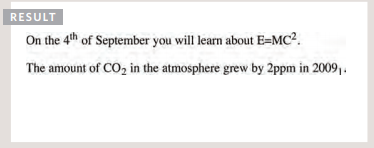

# COMMIT

Commits are the best ways to communicate your context about a change to fellow developers. It should tell the person reading it *why* the changes happened.

As a team, you should come up with a game plan on what commit message convention you want to use. This should help to define at least the **style**, **content** and **MetaData**. 
> *Style* is the markup syntax, wrap margins, grammar, capitalization, punctuation etc. This will help the log to remain consistent. 

> *Content* is about what kind of information the body of the commit message should or should not contain. 

> *MetaData* is how tracking IDs for issues, pull request numbers etc should be referenced.

## 7 Rules of a great *commit* message

According to Chris Beams ther are seven rules for a great commit message:

1. Separate subject from body with a blank line

2. Limit the subject line to 50 characters

    -If you have a hard time summarizing then you need to commit more often.

3. Capitalize the subject line

    -As simple as it sounds...start every subject like a new sentence.

4. Do not end the subject line with a period

5. Use the imperative mood in the subject line

    -*Imparative mood* means "spoken/written as if giving a command. Try not to use *indicative mood* when writing, which is all about reporting facts. A good commit line should be able to finish the below sentence: 
    > 'If applied, this commit wil...'

6. Wrap the body at 72 characters

7. Use the body to explain what and why vs. how

# HTML

We've already learned about a few HTML elements so lets add on to what we already know. 

### Visual editor vs Code views

*Visual editors* look like word processors. Generally they will have common features that allow you to control the presentation of the text.

*Code views* show you the code created by the visual editor so you can go in and code manually. 

### Elements

The `` element is used to contain characters that should be SUPerscript,like the suffixes in dates and math concepts. 

The `` elements is used to contain characters that should be SUBscript like footnotes or chemical formulas. 

*Whitespace* is the spaces between your text or strings that allow you to format your code to help make it easier to read. 

The `
` element helps to create a line between your text. This can be helpful when trying to separate sections. 

The ` ` element breaks where you tell it to for the users view. If you place it in the middle of a paragraph it will end the current line and break the next string of text into another line. 

`<strong>` element indicates has a lot of importance, usually shown as bold. 

`<em>` is an element that means emphasis such as italic. 

`<blockquote>` is typically used for longer quotes that can take up an entire paragraph. If you have a short quote that you would want to incorporate within a sentence the `<q>` element will help to put quotation marks around it. 

`<abbr>` helps with acronyms. If you've ever been on a site and hovered over an acronym and it shows you the name spelled out? This is what does that. 

`<cite>` is used when referencing a piece of work such as a book, film or paper. It can be used to indicate where the citation is coming from. 

`<dfn>` is used to indicate the defining instance of a new term. 

`<address>` is specifically used to contain contact details for the author of the page. This isn't limited to just address but also email or phone number. 

Changes to content: 

`<ins>` is used to show when content has been inserted, the text will show up underlined. `<del>` shows text that has been deleted, this will show up crossed through. `<s>` indicates something that's no longer accurate but should not be deleted, this too will show up crossed through. 

# CSS #

Let's talk about associating style rules with HTML elements. 

CSS rules are made up of *selectors* and *declarations*. The *selector* indicates which element the rule applies to. The *declaration* indicates **how** those elements selected should be styled. The **P** below is the selector and the text in italics is the declaration.

`p {
    *font-family: Arial;* }`

Within the declaration there are two more values: *property* which indicates what aspect you want changed and the *value* that specifies the setting. In the above example **font-family** is the property and **Arial** is the value. 

CSS can be written within the HTML file or by use of such links as the example below:

`<link href="name of file" type=" text/css" rel="stylesheet" />`

*link* lets HTML know that an outside sourse is going to be used to apply but alone it doesn't do much. Within the *link* you'll have to have the *href* that tells it where to find the file. The *type* to specify the type of document, which is 'text/css'. The *rel* specifies the relationship between HTML and the file linked, this should say 'stylesheet'.

If you decide to code your CSS internally within the HTML file you'll have have to use ``. Below is table with CSS selectors from the "Duckett: HTML & CSS" book:

CSS has application rules in that if two selectors are identical the last given rule will take precedence. If a selector is more specific than the others, that one will also take precedence. You can work around this by adding `!important` after a value to make this one beat out the others. 

# JAVASCRIPT #

In JavaScript (JS), a script is a series of instructions, these instructions are known as *statements*, every statement should end in a semicolon. Note that JS is case sensitive. Each statement should start on a new line. Some statements can be written within curly braces and these are known as *code blocks*, these are not followed by semicolons. 

### Comments ###

Comments help to explain what you're attempting to do to anyone reading your code. You create a comment using `/* enter comment here *\` tags for multiline comments and a simple `//` for single line comments. 

### Variables ###

In order for the computer to know what and how to run things, it needs help in *remembering* certain data which is called *variables*. If you wanted the computer to output an area you have to give it very specific instructions: 
1. *Remember* value for width
2. *Remember* value for height
3. Multiply width by height to get area
4. Return results

Lets take a look at the below and break down its parts:

Number: var quantity = x;
String: var text = 'message here';
Boolean: var test = true; 

To declare a variable you must give it a keyword and variable name, var is the keyword (you can also use 'let') and quantity is the variable name. The value assigned to this particular one is x. Values can be numbers or strings. When storing a number you'd just write the number and make sure to close it off with the semicolon. When making the value a string you'd just add '' marks. 

Rules for naming variables:
1. Name should begin with a letter, dollar signs or underscore only!
2. Name can contain letters, numbers, dollar signs or an underschore only! No dash or period should be used. 
3. Keywords should not be used, such as "VAR".
4. Variables are case sensitive, try not to create two with the same name and different cases. 
5. Use a name that easily describes the kind of info stored. 
6. If the name is made of more than one word make sure to capitlize every word after the first.

### ARRAYS ###

This is a special type of variable that stores a list of values. Below is an example of an array literal:

`colors = ['green', 'yellow', 'red'];`

Each item in an array has an automatically assigned number called an *index*. This index starts with '0'. To access that particular you would type the following: 

`var itemThree;
itemThree = colors[x]`

If you're looking to see how many items are in an array you could set the below: 

`var numColors;
numColors; = colors.length;`

Lets say, down the line, you want to change the items in the array without having to find the original list and edit it. You could update by typing the var name and the index number: 

`colors[2] = 'black';`

### Operators ###

Operators allow programers to create a single value from one or more values. There are math operators that help you to do basic functions such as addition, subtraction, multiplication, division etc. Keep in mind that these funcitons follow the PEMDAS order of execution. Dig deep into your mind about what the math teachers said about this!!

PEMDAS: Parenthesis, Exponents, Multiplication (*), Division (/), Addition, Subtraction. 

STRING Operators is applying a string as a value and creating a funciton name with those variables. For example: 

`let firstName = 'Joe';`
`let lastName = 'Doe';`
`let fullName = firstName + lastName;`

In the instance that you need to mix numbers and string you would just utilize the plus sign in between the two. For example, lets utilize the above example and add a string that says "hi": 

`let message = 'Hi ' + fullName;`

