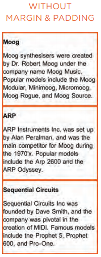
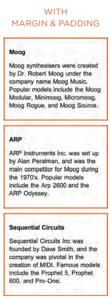
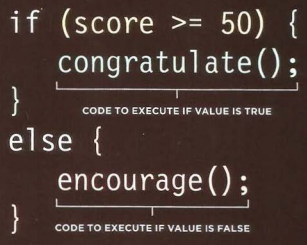

# HTML & CSS

Let's talk about lists baby!

There are three types of lists: 
1. Ordered 
2. Unordered
3. Definition

#### Ordered Lists ####

These lists are numbered. As used in recipes or set of steps. An `<ol>` element is used to created an ordered list. Within each `<ol>` is an `<li>` element to help list it out. 

`<ol>` 
        `<li> enter text here </li>` 
`</ol>`

#### Unordered Lists ####

These are lists that use bullet points instead of numbers. These items don't need to be placed in a particular order. A `<ul>` is used to create the unordered list. The same `<li>` will also be used with in these tags to list the items. 

#### Definition List ####

These lists are made up of a set of terms and definitions. You start the list with a `<dl>` element and within these tags you use `<dt>` to contain the term and the `<dd>` is used to contain the definition.

`<dl>` 
`<dt>` term `</dt>` 
`<dd>` definition `</dd>` 
`</dl>`

You can *nest* a list with in a list by simply creating sub-list using either the unordered or ordered list element and using the list element within. 

# Boxes # 

Each element lives in it's own box. We can control the dimensions and the look of these boxes. You'll use the following elements within your CSS file or script tag directly on the HTML file. 

When choosing the size of the box, you'll use 'height' and 'width', on average most people use pixels to determin the sizing. You can use percentage and this will change the size relative to the browser window. 

You can limit the width of the box to allow it to fit within a particular screen size so that it'll alter based on what the user is using. You would use a min-width or max-width. The same can be applied to the height. It will help to control the tesxt within a box so that it'll fit in any screen size viewed on. 

If you don't decide to select the min/max method you can apply the overflow element to give the option of hiding any extra content that doesn't fit in the box `(overflow: hidden;` or allow the user to scroll in order to read the rest by using `overflow: scroll;`.

## Border, Margin and Padding ##

### **Border** ###

Whether visible or invisible exists around the browser and content. 

- Border-width controls the width of the border. You can use pixel (no percentage) or any predefined values: thin, medium or thick. 
    - You can further control the different sides of the border by specifying top, right, bottom or let like so: `border-*side*-width: *value*;`. 
- Border-style gives you creativity in putting in a solid line or dotted, dashed or double. 
- Border-color gives you the option to pick one color for the entire box or even down to a different color for each side. To pick a different color for the other sides you'd code it the same way you'd want to change width. 

You can have so much fun with borders. CSS allows you to use images that you can stretch or repeat or round (this will scale th eimage so it'll fit) in order to fit the box. 

Rounding corners is as easy as typing `border-radius` with an added pixel value to give it some structure. Let your computer know which corners specifically by adding things like top-right or top-left etc. You can further create more complex shapes by playing around with the sizes. 

### **Margin** ###

Margin sits outside the edge of the border, this is where you could create a space between two borders. 

- You can change the margin using pixel or percentage as well as change which side has more of a margin, much like border. 

### **Padding** ###
Padding  is the space between the border and the content within. 

- You can use percentage here but generally pixels are used to define the padding. In the same way you can differentiate borders, the same applys to padding. By writing out `padding-*side*: *value*;`. 

###### JavaScript and Jquery. Duckett ######

###### JavaScript and Jquery. Duckett ######

### **Inline and block displays** ###

You can easily change the display of an inline to a block and vise versa in your CSS code. 
- inline: changes block level to inline
- block: changes inline to block
- inline-block: allows block to flow as an inline but keep other features
- none: will hide 

Visibility allows you to hide boxes from users but still have content in that space by typing somehitng like `visibility: hidden` or `visibility: visible`.

You can get as creativ as you like with CSS. Box shadows allows you to add a level of dimension to your site. Horizontal and vertical offset will position the box to the left or the top of the box. Blur distance will soften the color of the shadow and spread shadow, with a negative or positive value can expand or contract the shadow. 

# Javascript #

There are so many ways to check conditions to make sure your future site is running how it should. The IF/ELSE statement checks a condition and IF it's true it'll execute a certain code, ELSE if it is false it'll execute the second code given to it. 

For a real life example, lets say your condition is set so that a passing grade is above 70. You'd set your statement to where IF the score is below 70 you can give them a message saying they failed, ELSE if they have a score over 70, they'll receive a message that says they passed. 

Below is an example:

###### JavaScript and Jquery. Duckett ######

A SWITCH statement allows you to give the user options for an answer by creating a default option that'll run in case none of the other cases match. By typing break in between cases it tells the computer to stop running that particular code and move on to the next in case the condition hasn't been met. 

There are things that JavaScript does to help you out. Via type coercion, JS can convert data in order to help complete an operation. JS uses *weak typing* because the data type can change for a value. Some languages that require you to specify the data type uses *strong typing*