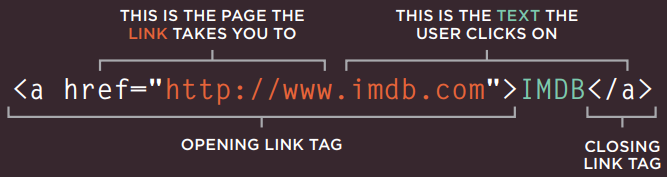

# HTML & CSS: CHAPTER 4 #

## Links ##

To allow users to click on a specified link you would use the `<a>` element. 

###### HTML & CSS: Duckett ######

Your link text is what you place between the `<a>` and it's closing tag `</a>`. It's better to give people an idea of what they're getting into when they click the link. You'd use href to specifiy the url for the site you want them to navigate to once they click the link. If you are trying to get them to a certain page within the site you can just use the relative URL, which is a shorthand. This way you would just href to the directory and file name. Basically giving the location of the file. 

Wanting to create an email line? You'd just add mailto: followed by the email address after your `href=`. 

By typing `target="_blank"` after your url or relative link, it will open a new window when any given link is clicked on. 

You can create a link within your page that will allow your user to go to a specific area of the page they are already on, similart to having the "to top" option so the user doesn't have to scroll. To do this, you'd have to give that part of the page an id. By doing this you've created a variable that can be linked in your `<a>` tag. Then you would just reference that id, like so: 

`<a href="#top"> Top </a>`

## Directory ##

By creating folders, also known as directories, you can create an organized structure within your code will help you as a coder to more readily and easily make any changes and to keep them seperate. 

# HTML & CSS: CHAPTER 15 # 

## Layouts ##

Block Level elements will alsways start on a new line and act as the main building block of a layout. Examples are `<h1>` `
` `<ul>` `<li>`.

Inline elements are as the name suggests, they flow between surrounding texts. Examples are `` `<b>` `<i>`. 

If you have a block element within another one, the outside one is called the *parent* element, the one inside is called the *child*. 

There are three positioning schemes that help to control the layout of a page. 

1) Normal Flow
    -This is the default behavior in that your text or paragraphs will appear one after the other down the page. 

2) Relative Positioning
    -This will shift any given text to the top, right, bottom or left without messing with the other text surrounding it. 

3) Absolute Positioning
    -Will take the content out of normal flow and does not affect the surrounding elements. These positioned elements will move as users scroll. These can be the nav bar that moves up and down with the page. 

# JavaScript & JQuery: Chapter 3 #

Functions allow you to group a series of statements together to perform a specific task. You have to create variables with *parameters* to pass on the information. Once a funciton is created it will have to be *called* on so that the computer knows to perfom that task, the expected return is called the *return value*. 

A basic function looks like 

>`function nameOfFunction() {` 
>    `document.write('message')` 
>`}`

When calling the function to make it process the code, you would just type `nameOfFunction();` on a separate line. 

If you have a function that requires information, like a math function. You would call it in the same mannger, except you would add the needed information. 

For example: 

>`function getArea(width, height) {` 
>`return width * height;` 
>`}`

You'd would type `getArea(3, 5);`. This is asking the funciton to return area if the width is 3 and the height is 5. 