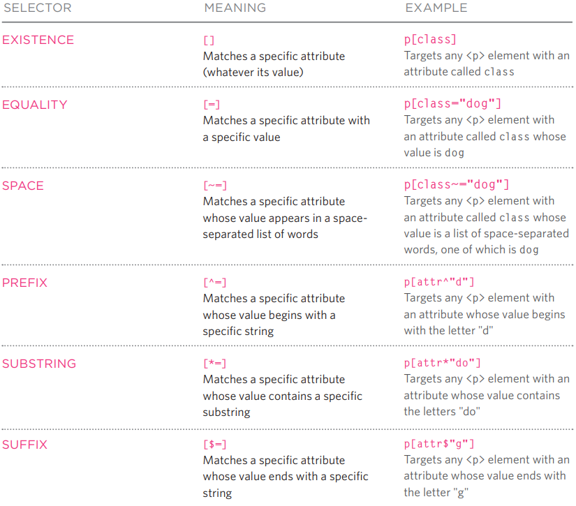

# HTML & CSS #
## CHAPTER 5 ##

No one wants a text only site. As much as we are adults, we have inner children that need a break from words via images. When including images into your site, it's best to stay as organized as possible by creating a separate IMG folder within your repo to house all the images you'll be using for your site. 

The `` element to add an image to your site. So let's break it down, `img` lets the page know that you want an image added, the `src` tells it where to find the image and the `title` lets it know specifically what image within the source to select and show. By adding `alt="description"` after the image title, it gives the picture a text description in case the image is broken and can't be seen. This is helpful to those who visit your site with visual impariments. 

When you copy in or save an image, sometimes the original size doesn't quite fit how you want. Adjusting the size is as easy as adding a `height` and `width` element within your `img` tag. Placement of the photo within your code is important. If you place it before a block element, like `
` or `<h>`, it'll place it in a different line. If you place it within your inline elements the picture will be wrapped around the image. Using the `align` element helps the page understand how it should flow around the image, although this has been discontinued you still may come across this in older codes. 

Captioning a photo can help the user understand the photo as well as give more detailed information than you may want to include within your paragraph. `<figure>` element helps to contain images and their captions, it will allow you to house more than one image. You can add a caption by using `<figcaption>`. 

There are three rules for creating images: 

1. Save images in the correct format.

    JPEG: is best for images with many different colors
    GIF or PNG: used images with few colors or large areas of same color.

2. Save images in the right size. 

    Use editing tools to resize photos to the size you want it to show on your site. 
    Before downloading an image you can check the size by right clikcing and opening image in a new tab, this will give you the size informaiton. 

3. Use the correct resolution. 

    Save images at 72 ppi for images created for the web. 

## Chapter 11 ##

Colors are fun! CSS gives you multiple ways to specify a color for your site. You can use RGB values, HEX codes or color name. If you have issues deciding on a color way for your site you have options of using a color picker that will help generate what colors will harmonize well with any particular color you may choose. It's important to take into consideration things like contrast, opacity, hue, saturation and lightness. 

`color` specifies for the text. 
`background-color` specifies for the site or specific boxes. 
`hsl()` helps you to define the hue, saturation and lightness of the colors you are using. 

## Chapter 12 ##

Typeface will have an impact on how readable your page will be for users. There are usually three terminologys for the print of letters. Serif fonts have an extra detail at the ends, this is usually the text used in long passages because it is believed to be easier to read. Sans-Serif are clean cut letters and is clear to read in smaller fonts. Monospace letters have the same width, these are commonly used for code because they align nicely. 

`font-weight:` determine how thin or bold they are. Options are either normal or bold. 

`font-style:` will determine italics and such. Options are normal, italic or oblique. 

`font-family:` is the element used to specify typeface. Hopefully the people visiting your site will have these typefaces installed on their computer. 

`font-size:` enables you to specify the size of the text. You can usually use pixels (px), percentages or EMS. EMS, written in decimals, is equivalent to the width of a letter. Percentages normally go based on the browser. 

`text-transform:` changes the case of the text using `uppercase`, `lowercase` or `capitalize`. 

`text-decoration:` gives you the option to `underline`, `overline`, `line-through` or `blink`. Blink animates the text to blink on and off. 

`line-height:` sets the height of an entire line of text. 

`letter-spacing:` and `word-spacing:` do the same thing but apply to different parts, spacing of the letters in the words versus spacing between the words. 

`text-align:` helps you to control alignment to the left, right, center or even justify (indicates every line in the paragraph except for the last line to take up the entire width of its containing box). `vertical-align:` is commonly used with inline elements such as ``.

`text-indent:` allows you to indent the first line of text. You can specify how much you want it indented by using pixel or ems. 

You can change the color and style of a links by using `:link` and even change the color of a previously clicked link using the `:visited` pseudo-class. You can also have fun by using interactive pseudo-classes such as `:hover` that can change the color of whatever the mouse hovers over. `:active` gives the feeling that the buttons is actually being clicked. `:focus` occurs when a browser can sense that you are ready to interact with an element, like a form. 

There is an order to the pseudo-classes when creating a code: link, visited, hover, focus, active. 

Things to consider when coding: 
- If you are coding from a mac, you should test on a PC because it can render less smoothly. Coding from a PC shouldn't be an issue. 

Attribute selectors help you to target a particular element in order to change it's appearance. 

