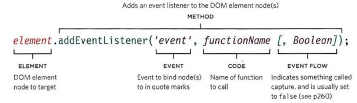

# HTML CSS #
## Chapter 7 ##

Forms are an important part of an interactive site. It allows users to search and perform other functions online. Most sites use forms to get user inputs like log ins to ordering things online and even uploading documents. 

A form lives inside the `<form>` element with an action, method and id attribute. The action attribute is the url for the page that will take in the information. There are two methods: get or post. The get method is ideal for short forms like search boxes and retrieving data that doesn't need to be deleted or added to a database. The post method is where the info is sentto an HTTP header. These method is usually used for sites that allow a user to upload a photo, contains sensitive data, adds or deletes info to or from a database. The id is used to identify the form from other elements. 

`<input type="text" name="username" size="15" maxlenth="30" />`

The text input is added with the `<input type>` element, this allows you to create several form controls. This is where you would input the specific attributes you want with the input. For example the type for a username entry should be text so that the user can enter text. The name is what the user will see next to the space for them to write and the maxlength to cap how many characters any one can input. 

`<textarea>` is used for multi-line text input, much like a comment box. Anything between the tags will appear on your page. 

Dropdown lists allows for more space on the site. You can create this with the `<select>` element and should have two or more `<option>` values. If you want to allow a user to be able to select multiple of the options in the dropdown, just add a "multiple" option like so: 

`<select name="instruments" size="3" multiple="multiple">`

If you want to allow your users to upload a document then you'll need to have the `<input type=>` element. If partnered with "file" it creates a input box with a browse button to allow them to find the file they want to upload. Here is an example: 
`<input type="file" name="user-song" />`

Types: 

Grouping related items within the form can be accomplished using the `<fieldset>` element. Within these tags you'll have a `<legend>` that will identify the purpose of the group.

It's important to validate informaiton being submitted into the forms. 

You can get creative with how your buttons look on your form within the `<button>` tags. You can only show a button without the input box which will use the "hidden" type to create.

Make sure you make your page accessible to all people, including those who are vision impaired by adding a `<label>` to each form control.

Types: 
"password"
"username"
"radio": allows user to pick one of a number of options. 
"checkbox": allows user to un/select one or more option.
"submit" will send a form to the server. 
"image" will make the button look how you want it. 
"date"
"email"
"url": if you are asking for a website input
"search": for seach queries
 

## Chapter 14 ##

### Lists, tables and Forms ###

Lists don't have to be boring, you can doctor any list up. There are two types, orderec and unordered. Unordered lists use bullets, whereas an ordered list will use numbers or letters to show that there is an order.  
`list-style-type:` is how you can tell your site what kind of character you want to use in your lists.  
`list-style-image:` followed by an image allows you to use that image as a bullet point so you can make your page super fantastic.  
`list-style-position:` is how you tell the marker to sit on the insdie (indented) or outside of the text. 

Tables use a lot of the same properties we've already learned in previous readings. Here is a short review of some of the things you can use: 

`width` to set the width of the table  
`padding` to set the space between the border of each table
cell and its content  
`text-transform` to convert the content of the table headers to
uppercase  
`letter-spacing`, `font-size` to add additional styling to the
content of the table headers  
`border-top`, `border-bottom` to set borders above and below the table headers  
`text-align` to align the writing to the left of some table cells and to the right of the others  
`background-color` to change the background color of the alternating table rows  
`:hover` to highlight a table row when a user's mouse goes over it  
`empty-cells: show` shows the borders with no context 
`empty-cells: hide` hides the borders of an empty cell 
`empty-cells: inherit` will tell the current cell to inherit the rules of the containing cells.  
`border-collaps` cells are pushed together with no spacing between boxes.  
`border-spacing` borders are detached from one another. 

# JavaScript #
## Chapter 6 ##

An event can trigger a function or a script within your javascript code. It can be anything from loading a page to scrolling to clicking. You're going to have to think like a user and imagine what will happen when certain events occur. So if they are submitting a form, what will happen when they click submit? Then create the function or script that you want to happen when the event happens. 

There are three ways to bind an event to an element. *HTML event handler*, while not used, is good to know so you can recoginze in older code. We won't talk about it much here but feel free to do some digging on your own time. 

The second way is through *traditional DOM event handlers*, these only allow you to do one at a time. Below is an example of the syntax:  
`element.onevent = functionName;` 
The event name is preceded by "on" and the entire line is written after the node has been selected. Notice that the function name doesn't have the parenthesis, that's because we don't want it to run immediately. We need it to run when the event occurs. 

The final way is using *event listeners* which allows you to work with more than one function but are not supported on older browsers. 

Since you wouldn't have the parenthesis in the function you'd have to add an *anonymous function* in order to create another argument. 