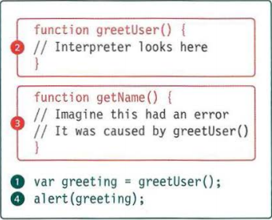

# JAVASCRIPT & JQUERY #
## Error handling & Debugging ##

Order of execution is important in writing out a script. Some takss cannot be completed until a statement or function has been run. 

For example when creating a function to greet the consumer you have to first create the variable and then the functions. If you did it the other way around, when it tries to run a function without variable to tell it what something means it'll be undefined.

Execution contexts has three areas that a script can live in: 

1) Global context: code that is in the script but not in a function.

2) Funciton context: code that is being run within a function, each function has it's own. 

3) Eval context: text that is executed like code in an internal function called 'eval ()'. This isn't covered in the book. 

Global and function context correspond with the notion of scope. Global scope is if a variable is declared outside of a function it can be used anywhere because it is GLOBAL. Function level scope is when the variable is declared within a function and can't be called outside of it. 

As you recall; JavaScript can only interpret one line of code at a time. If a statement has to call some other code to do it's job, the new task goes to the top of the pile of to do list. Each time a new item is added it creates a new execution context. 

There are two phases of activity that happens when a script enters a new execution context. 

1. Prepare: the new scope, variables, functions are created and the value of the keyword is determined. 

2. Execute: it assigns values to the variables, references functions to run the code and executes the statements. 

Understanding how to read the code will help in pinpointing errors. When an error happens it stops the entire process. Kind of like an assembly line. If an error does happen JS will go to the line of code that called the function, then it'll look inside the function itself before moving on to the code that was used inside the previous function. In the below example it numbers the order in which codes are reviewed for errors. 

 

## Errors ##

*Error objects* can help you easily find where your mistakes are by giving you name, message, fileNumber and lineNumber properties. This is usually given to you in your console (which can be found by right clicking a site, selecting "inspect" and then navigating to "console).

For the most part they are labled with error objects: 
    -**ERROR** is just a generic error 
    -**SyntaxError:** means there is an issue in the syntax. This could be as small as a missing comma to an incorrect single or double quote. It's all about how the code reads. 
    -**ReferenceError:** attempted to use a variable that was not declared 
    -**TypeError:** is an unexpected data type  
    -**RangeError:** numbers not in acceptable range. Examples like NAN (not a number) or creating arrays with a negative number. 
    -**URIError:** encode or decode URI methods are used incorrectly 
    -**EvalError:** eval function used incorrectly

## Debugging ##

Debugging is about deduction
